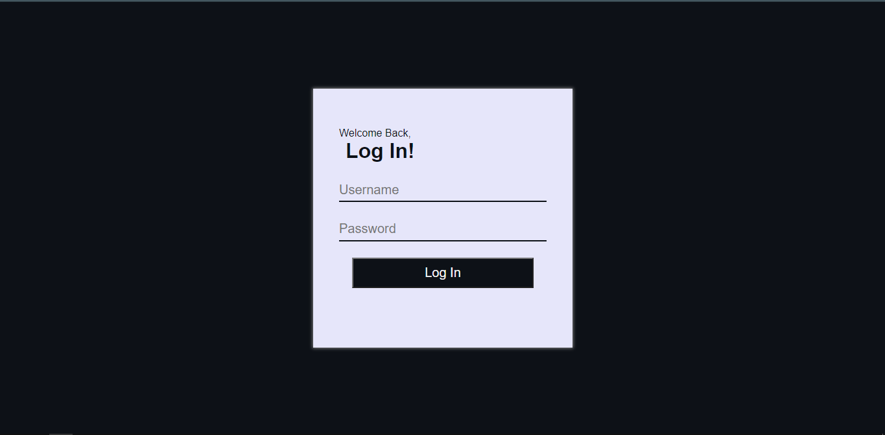
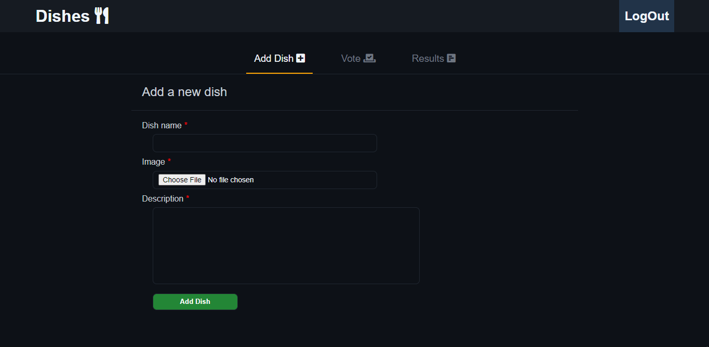
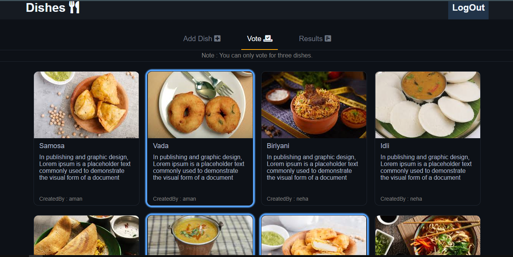
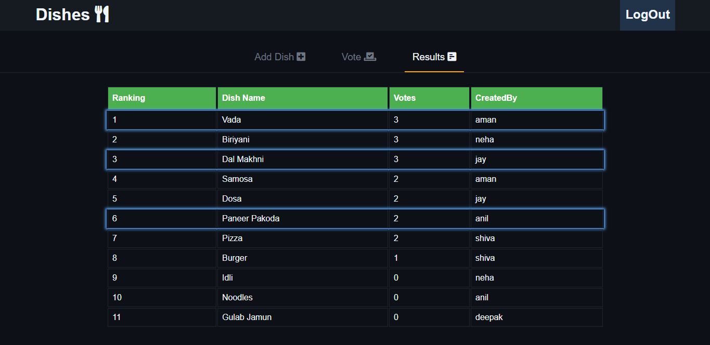

## [`Dishes Webapp Demo`](https://devilzer.github.io/Dishes/)

## [`App Video Walkthru`](https://drive.google.com/file/d/10cSQXTVTt0wbATqKHoy0gvQHL1uI5mdI/view?usp=sharing)

## Features

* User Login.
* Add new dish.
* Alert notifications.
* Dish voting.
* Dish Polling results/rankings.
* Persistant redux state.

## How to install and run?

1. Clone the repositories.
2. Install all dependencies by `npm install`
3. `npm start`

## Login details.

* username : "deepak" ,  password : "deepak123"
* username : "aman"   ,  password : "aman123"
* username : "anand"  ,  password : "anand123"
* username : "neha"   ,  password : "neha123"
* username : "nikhil" ,  password : "nikhil123"
* username : "jay"    ,  password : "jay123"
* username : "anil"   ,  password : "anil123"
* username : "ankit"  ,  password : "ankit123"
* username : "ankit"  ,  password : "ankit123"
* username : "pankaj" ,  password : "pankaj123"

## App Overview.

#### LogIn.
 

#### Add Dish page.
Page with form for dish creation.
 

#### Vote Page.
Vote page with list of dishes to vote.
 

#### Results Page.
Page with poll result details.
 

## Directory Structure
`components` Contains all the React components. 
`redux` Contains Redux State mangement files (acitons,reducers). 
`style` Contains SCSS file for App styling. 
`config` Contains noty config files for notifications.
